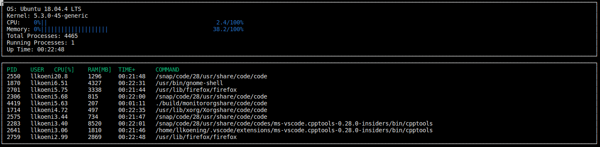

# System-log Monitor Project

---

## Project Overview

### Goals

- Utilize object-oriented programming to develop a system monitor for Linux, similar to htop.
- Bonus: Enhance CPU usage data accuracy by obtaining real-time data instead of aggregated data.

### Structure

The project is organized into different files. All header files can be found in the `include` folder.

- `src/main.cpp`: Invokes the system and ncurses logic.
- `src/format.cpp` (and header file): Contains functions for string formatting, such as time format.
- `src/ncurses_display.cpp` (and header file): Provides functionality for displaying results in the terminal.
- `src/linux_parser.cpp` (and header file): Contains functions to read data from the Linux file system.
- `src/system.cpp` (and header file): Defines a class for system data and logic.
- `src/process.cpp` (and header file): Defines a class for process data and logic.
- `src/processor.cpp` (and header file): Defines a class for processor data and logic.
- Other helper, build, and installation files.

### Dependencies

This project requires the following dependencies:

- Linux-based OS with Linux >= 2.6
- cmake >= 3.11.3
- make >= 4.1 (Linux)
- gcc/g++ >= 7.4.0
- ncurses
  - [ncurses](https://www.gnu.org/software/ncurses/) is a library that enables text-based graphical output in the terminal.
  - Use `sudo apt install libncurses5-dev libncursesw5-dev` to install ncurses.

### Basic Build and Run Instructions

1. Clone this repository.
2. Install the required dependencies.
3. Build and compile: `build all`.
4. Run the program: `./build/monitor`.
